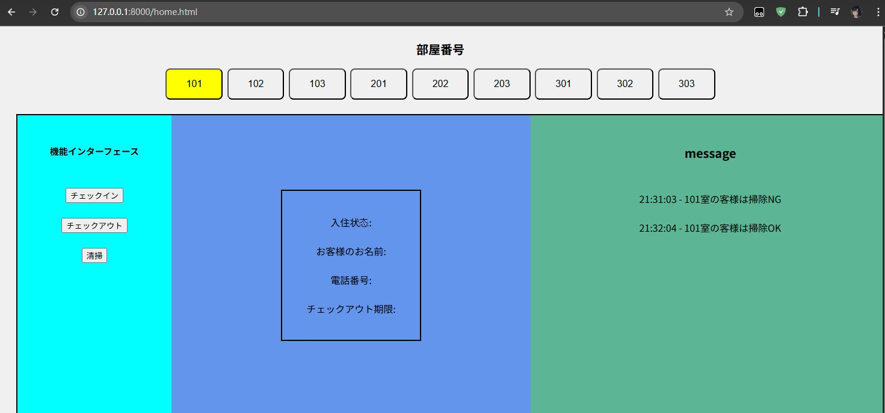

# プロジェクト概要

「ClassJob」は、学校の課題の一環として作成されたコラボレーション開発用のライブラリです。本プロジェクトでは、以下の内容が含まれています：

開発文書 ([仕様書 (PDF)](仕様書.pdf)) - 詳細な開発ガイドラインとプロジェクトの構造。

codeフォルダ - ホテル管理システムに関連するコードとリソース。

# 使用技術

HTML - フロントエンドのマークアップ。

Python - バックエンドロジック。

CSS - スタイルシート。

Flask

このプロジェクトは、協力してソフトウェア開発を学ぶことを目的としており、チームワークと技術力の向上を図っています。
